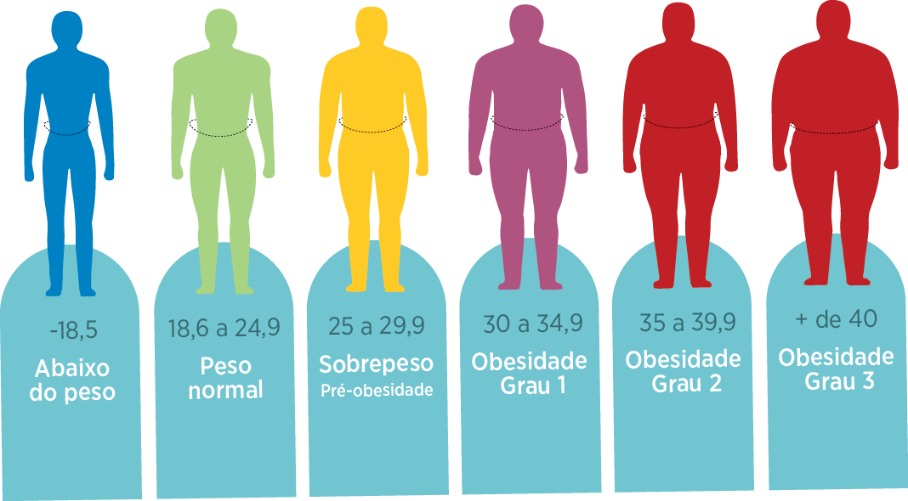

    
    

        <h1 style="display: flex; justify-content: center;" >CALCULADORA IMC</h1>
    

## PARA COMEÇAR

- Informe sua altura 
- Informe seu peso

## LICENÇA 📝

Esse projeto usa a licença MIT license - veja o arquivo [LICENSE](LICENSE) para mais detalhes

# AUTOR

<table>
  <tr>
    <td align="center"><a href="https://github.com/jadson179"> <b>Jadson Santos</b></a> <a href="https://github.com/jadson179/CALCULADORA-IMC/commits?author=jadson179" title="Code">💻</a> <a href="https://github.com/jadson179" title="Design">🎨</a></td>
  <tr>
</table>